# LexiVault

## Project Overview

LexiVault is a private AI document intelligence tool featuring a novel **India-specific Hinglish legal explanation engine**. It reads legal and business documents, extracts key clauses, flags risks, explains complex jargon in plain English, Hindi, or conversational Hinglish, and helps users make decisions about what they are reading. The document parsing, embedding generation, and vector database search pipeline runs on the host machine to ensure confidentiality (note: an active internet connection is required for external Groq Cloud LLM and Wolfram Alpha API requests).


## Problem Statement

When a contract, NDA, vendor agreement, or other legal document needs to be reviewed, professionals typically face three imperfect options:
1. Send the document to a public LLM cloud service, which is fast but risks leaking confidential business data.
2. Review it manually, which keeps the data private but takes hours and increases the chance of human error.
3. Hire external legal counsel, which is highly accurate but expensive and slow.

LexiVault is designed to be fast, private, and accurate simultaneously, providing a comprehensive suite of document intelligence and contract negotiation tools without the entire document ever being uploaded to the cloud (only short retrieved context chunks are sent to the external LLM API):

## Features

### Core Features
* **Bilingual Chat & Q&A**: Ask natural language questions in English or Hindi about your uploaded documents and get response citations with exact page numbers.
* **Hinglish Code-Switching Engine (India-Specific)**: Translate complex legal jargon directly into conversational Hinglish (Hindi written in the Latin alphabet, e.g., *"Is clause ka matlab hai ki..."*) for intuitive, culturally tuned understanding.
* **Risk Scorer & Analysis**: Extract critical clauses and automatically score risks (High/Medium/Low) based on liability caps, indemnification, non-competes, and termination, with Wolfram Alpha context integration.
* **Plain Language Mode**: Translate complex legal jargon into clear, one-sentence explanations without losing legal meaning.
* **Decision Brief Generator**: Generate structured, multi-document summaries with risks and strategic recommendations.
* **Contract Redline Autopilot**: Compare two versions of a contract to highlight character changes and analyze legal impact.
* **Contradiction Detector**: Automatically scan and flag conflicting terms across multiple agreements.

### Advanced Features
* **AI Negotiation Sandbox & Opposing Counsel Pushback Simulator**: Simulate clause-by-clause debates between customizable Buyer and Seller counsel personas, or input a proposed edit to predict counterarguments and alternative clauses from opposing counsel.
* **Negotiation Ghostwriter**: Draft diplomatic compromise language or legally sound rejections with alternatives when receiving counterparty redlined edits.
* **Semantic Diff Analyzer**: Compute similarity changes between two clauses using sentence vector embeddings computed on the host machine and generate a structured audit explaining the legal shifts in rights or obligations.
* **Contract Lifecycle Timeline Predictor**: Estimate negotiation duration, renewal risks, and expiration cascades using LLM temporal graph analysis on contract metadata.
* **Cross-Document Portfolio Risk Dashboard**: View portfolio-level analytics such as active contracts, total financial liability, vendor concentration risks, and renewal timeline cliffs.
* **The Shadow (AI vs. AI Contract Battle)**: Select a document to watch adversarial Attacker and Defender AI counsel debate clause liabilities and deliver a final legal risk assessment.
* **The Residue (Invisible Document Forensics)**: Run binary inspections of PDF bytes to extract hidden metadata (author, tools, creation dates) using PyMuPDF and perform text checks for altered boilerplates.
* **The Echo (Cross-Language Legal Harmonics)**: Compare semantic legal weight and translation traps (e.g. "best efforts" vs "reasonable efforts") across English, Hindi, and Hinglish.
* **The Alchemy (SLA-to-Code Compiler)**: Automatically extracts service level agreement (SLA) bounds (such as uptime percentages, latency thresholds, and support resolution times) and compiles them into Prometheus Alert YAML rules. This allows engineering leads and product managers to immediately enforce vendor legal commitments directly in their production monitoring dashboard.

### Seamless Workspace Transition
LexiVault blends a content-rich landing page with a dedicated, focused web-application dashboard:
* **Zero-Friction Entry:** The interactive Workspace is accessible directly at the bottom of the landing page.
* **Instant Fullscreen App Mode:** The moment you engage with the workspace—whether by uploading a file, selecting a tab, clicking interactive cards, or focusing a chat/text input—the landing page copy, headers, and footers are hidden, and the workspace instantly transitions into a distraction-free 100vw/100vh application viewport.
* **Full State Preservation:** Using a single-mount layout architecture, all React state (such as indexed documents, active chat history, form inputs, and compiled outputs) is preserved during fullscreen toggling.

---

## Product Showcase

### 1. Interactive Landing Page & Advanced Mockups
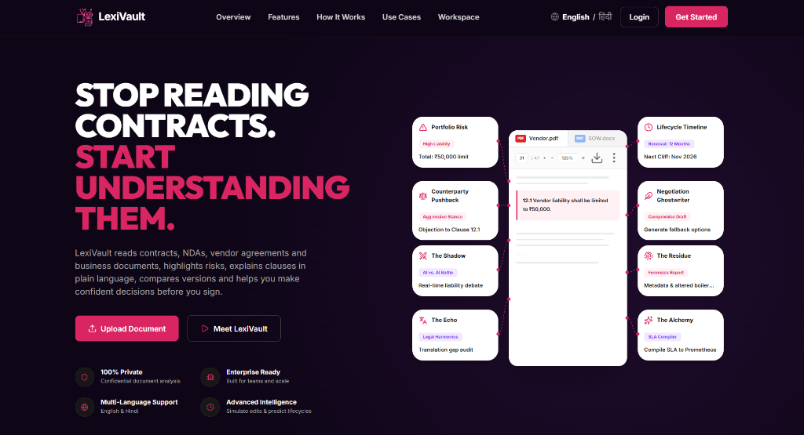

### 2. Multi-Contract Portfolio Dashboard


### 3. Core Workspace Features
<details>
  <summary>Click to view Core Analysis Showcase (Chat, Risk Scoring, Plain Language, Brief, Redline, Contradictions)</summary>
  <br/>

  #### Bilingual Chat & Q&A
  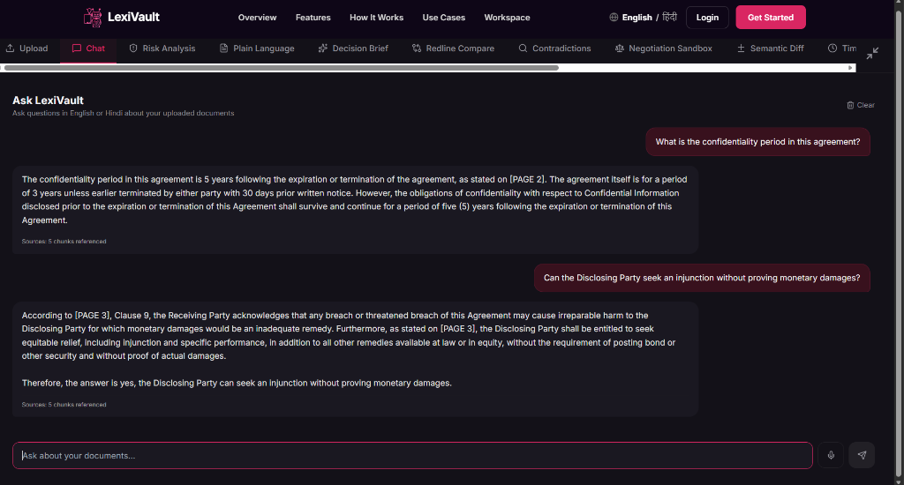

  #### Risk Scorer & Analysis
  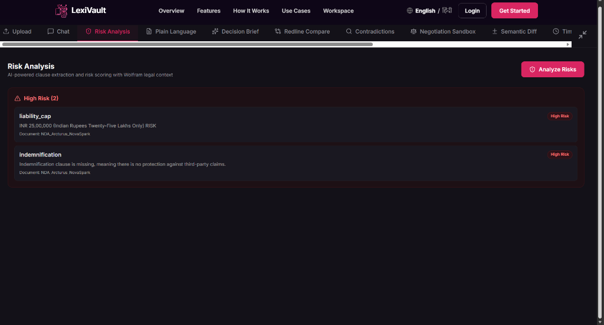

  #### Plain Language Mode
  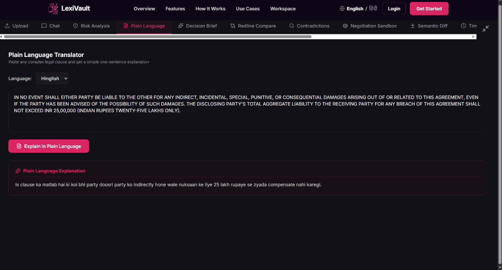

  #### Multi-Document Decision Brief
  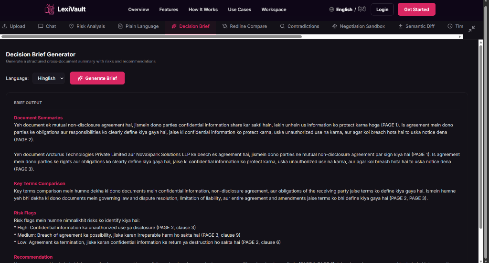

  #### Contract Redline Compare (Hindi Output)
  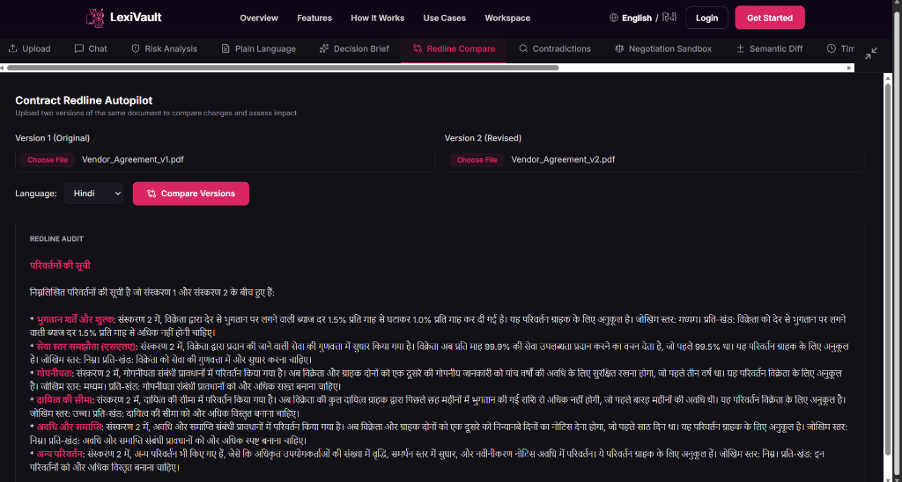

  #### Contradiction Detector (Hindi Output)
  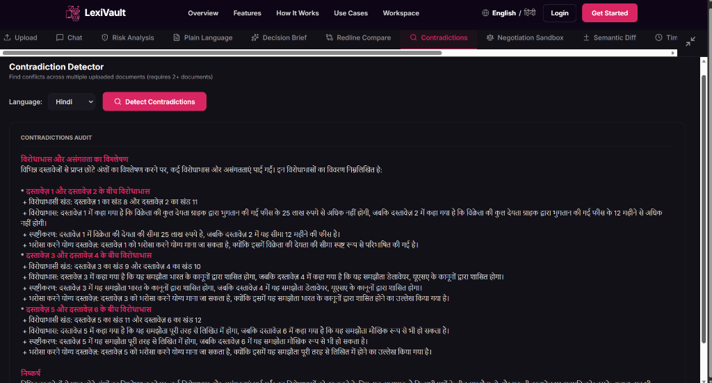
</details>

### 4. Advanced Intelligence Showcase
<details>
  <summary>Click to view Advanced Features (Negotiation Sandbox, Semantic Diff, Contract Battle, Timeline, Forensics, SLA Compiler)</summary>
  <br/>

  #### AI Negotiation Sandbox
  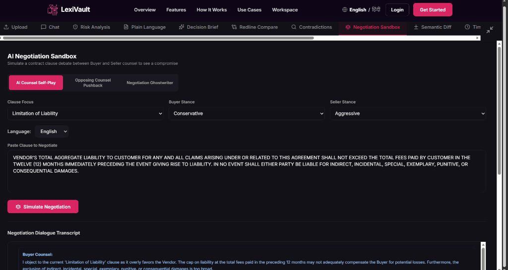

  #### Semantic Diff Analyzer
  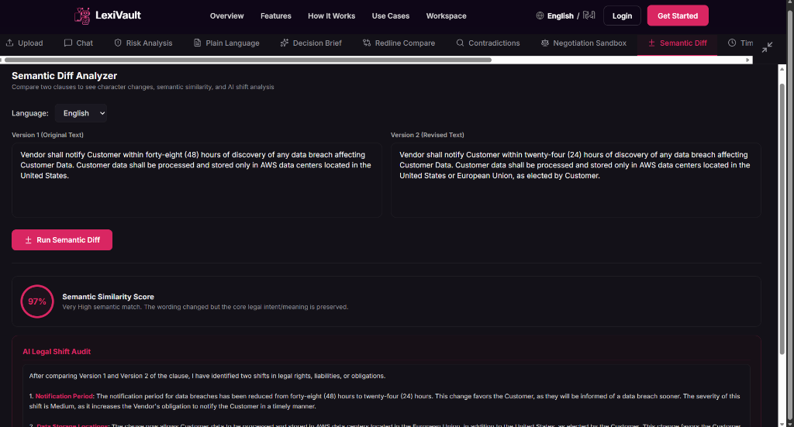

  #### AI vs. AI Contract Battle (The Shadow)
  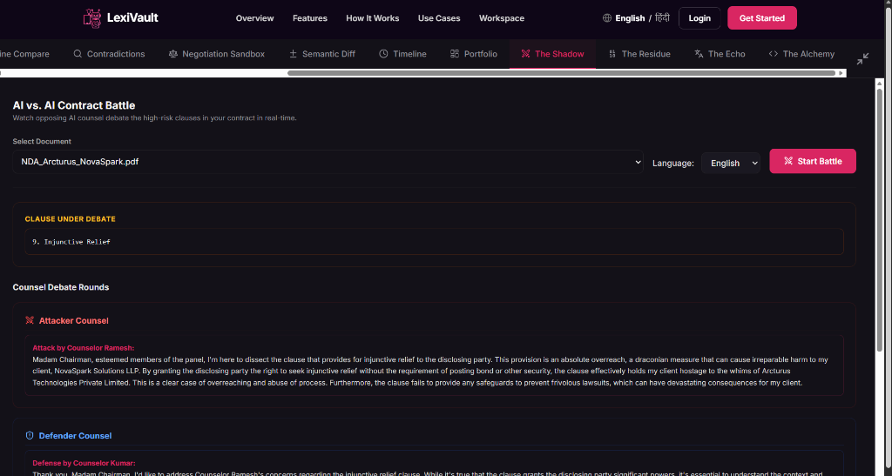

  #### Contract Lifecycle Timeline Predictor
  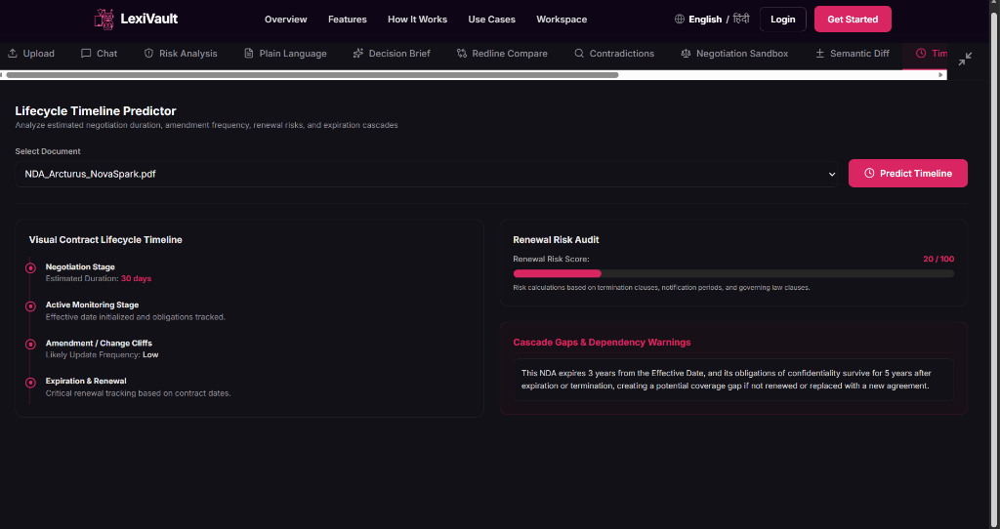

  #### Invisible Document Forensics (The Residue)
  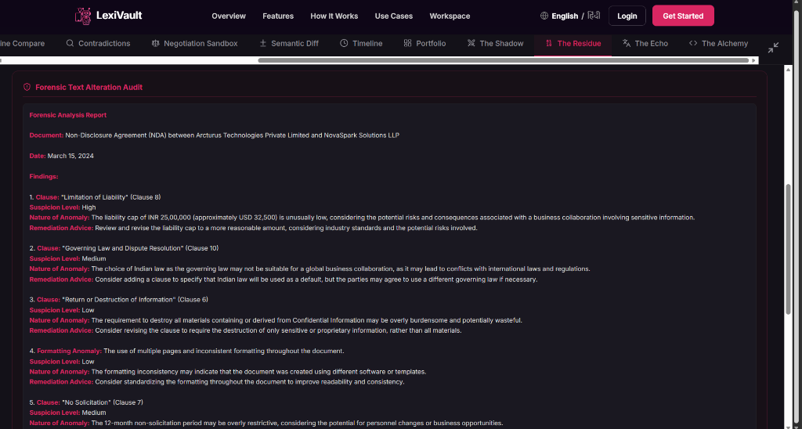

  #### Cross-Language Legal Harmonics (The Echo)
  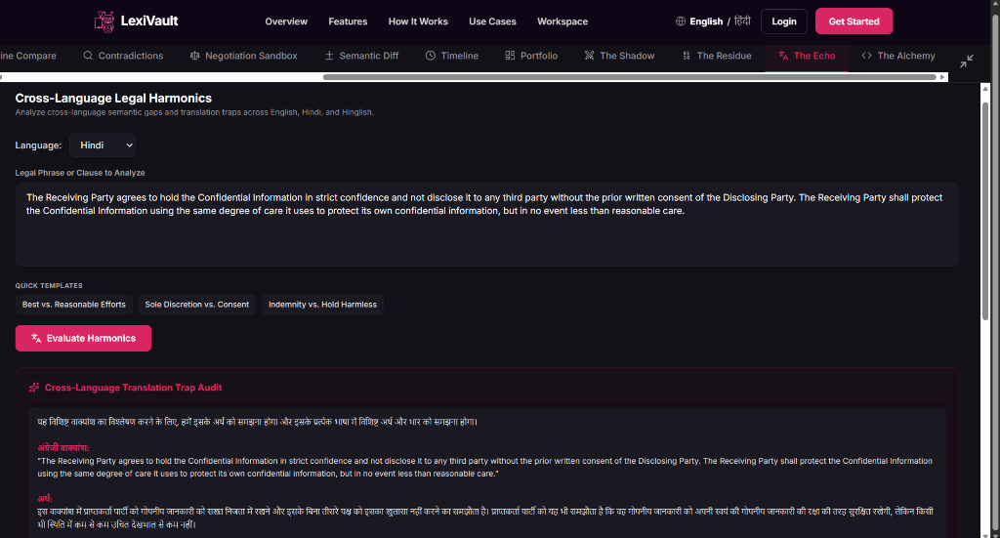

  #### Contract-to-Code Compiler (The Alchemy)
  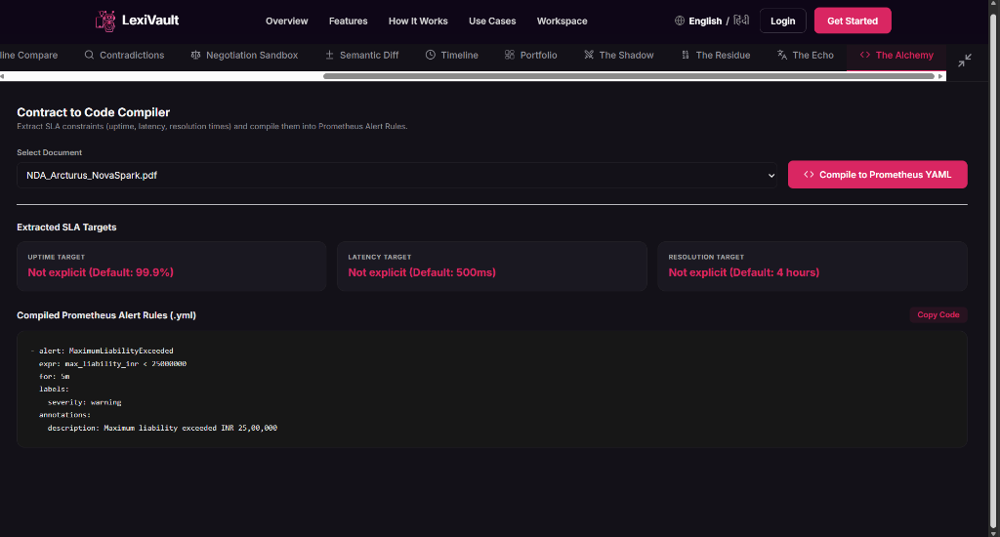
</details>

---

## Target Audience

LexiVault is tailored for professionals who frequently handle legal and business documents without a dedicated legal team:
* Startup Founders & Product Managers: Who review and sign dozens of contracts, NDAs, and vendor API service level agreements (SLAs).
* HR Professionals: Who audit employee handbooks, policies, and contracts.
* Business Consultants: Who compare multiple complex proposals or statements of work.
* Engineering Managers & DevOps Leads: Who need to bridge the gap between legal vendor SLA commitments (e.g., uptime, latency thresholds) and operational monitoring configuration.

---

## Technical Architecture and Privacy Model

LexiVault uses a hybrid host-ingestion RAG (Retrieval-Augmented Generation) pipeline:

1. Text Extraction: PDF files are parsed on the host machine using PyMuPDF and pdfplumber. No text extraction is sent to external APIs.
2. Chunking: Extracted text is split into semantic chunks on the host machine.
3. Host-Based Embeddings: Chunks are converted into vector representations on the host machine using a multilingual sentence transformer model (paraphrase-multilingual-MiniLM-L12-v2).
4. Vector Storage: Vector embeddings are indexed and stored on the host machine using a FAISS vector database.
5. Retrieval: When a query is made, the most relevant chunks are retrieved from the host-managed FAISS index.
6. Cloud-Based LLM Inference with Host-Retrieved Context (Groq Cloud API): To generate responses, summaries, and legal audits, only the relevant retrieved text chunks (never the entire document) are sent to the LLM (Llama 3.3 70B / Llama 3.1 8B via the Groq Cloud API). High-risk clauses are cross-referenced with Wolfram Alpha to retrieve legal definitions and context.
7. Host-Based Semantic Similarity: The Semantic Diff Analyzer calculates sentence vector similarity on your host CPU using the host-based embedding model, before calling the LLM to audit the legal shifts, ensuring comparison data remains private.

> [!NOTE]
> All document ingestion (parsing, chunking, embeddings) and retrieval (vector storage, top-k similarity search) occur 100% on your host machine. Final LLM inference is powered via the Groq Cloud API using ONLY the matching host-retrieved context chunks.

### API Model Routing & Resiliency Details
* **Primary Legal Inference Model (Llama 3.3 70B):** LexiVault uses `Llama 3.3 70B` (`llama-3.3-70b-versatile`) via the Groq Cloud API for all primary legal logic, risk scoring, contradiction audits, and negotiation simulations. Its large parameter size is necessary to handle complex legal terminology and reasoning.
* **Automated Rate-Limit Failover (Llama 3.1 8B):** To prevent request failures under high-traffic conditions or token/rate limit exhaustion (HTTP 429), the backend utilizes a custom python resiliency wrapper (`ResilientChatGroq`). When a rate limit exception is caught, the request is instantly and transparently rerouted to the lightweight **Llama 3.1 8B** (`llama-3.1-8b-instant`) model, guaranteeing high availability.

### Contract Lifecycle Timeline Predictor: Technical Workflow
How does "temporal graph analysis on contract metadata" work technically?
1. **Metadata Extraction:** Upon contract upload, LexiVault uses structured metadata extraction prompts to parse the document and extract key dates (`effective_date`, `expiration_date`), the counterparty (`vendor_name`), and specific termination or amendment notice windows.
2. **Chronological Event Node Map:** The extracted dates are mapped into a chronological dependency graph (nodes represent contract milestones: Execution, Expiration, Notice Deadlines; edges represent elapsed durations and dependencies).
3. **Temporal Gap & Dependency Analysis:** The engine programmatically inspects this graph to spot contract timeline overlaps or dependency errors. For instance, it flags a "coverage gap" if an NDA/SLA sub-agreement's expiration date falls before the master service agreement (MSA) expiration date.
4. **Renewal Risk Scoring:** A risk score is computed by correlating the remaining contract duration against the required notice period for termination, flagging imminent renewal cliffs.

---

## Tech Stack

LexiVault is built using a modern, performant, and premium stack spanning local ingestion and robust cloud LLM APIs:

* **Frontend:**
  * **Framework & Core:** React (TypeScript) and Vite for super-fast build times and hot module replacement.
  * **Styling & Aesthetics:** Vanilla CSS and Tailwind CSS using a midnight dark and hot pink theme.
  * **Icons:** `lucide-react` for outline iconography.
  * **Speech Capabilities:** Native Web Speech API for bilingual text-to-speech and speech-to-text dictation.
* **Backend:**
  * **API Framework:** FastAPI (Python) for asynchronous, high-performance REST endpoint processing.
  * **Document Ingestion & Parsing:** PyMuPDF (`fitz`), `pdfplumber`, and `python-docx` for robust document reading.
  * **OCR Engine:** Tesseract OCR (via `pytesseract`) for scanned document text extraction.
  * **Vector Database:** FAISS (`faiss-cpu`) for fast similarity index search.
  * **Embeddings Model:** `sentence-transformers` utilizing the `paraphrase-multilingual-MiniLM-L12-v2` model computed directly on the host machine.
  * **LLM Orchestration:** LangChain and `langchain-groq` for structured legal Q&A chains.
* **APIs & External Services:**
  * **Primary LLM:** Groq Cloud API running **Llama 3.3 70B** (`llama-3.3-70b-versatile`) for deep reasoning and legal audits.
  * **Fallback LLM:** Groq Cloud API running **Llama 3.1 8B** (`llama-3.1-8b-instant`) for fast rate-limit resiliency.
  * **Legal Definitions & Context:** Wolfram Alpha API for definitions of indemnification, liability caps, and termination.

---

## Project Structure

* / (Root) - Python FastAPI backend containing modules for PDF parsing, text chunking, host-based embeddings, FAISS storage, and LLM integrations.
* /frontend - React, TypeScript, and Tailwind CSS user interface.

---

## Backend API Endpoints

The FastAPI backend (`app.py`) exposes the following endpoints:

### Core Document Management
* **`GET /api/documents`** (`get_documents`): Retrieves the list of currently indexed documents and their namespaces.
* **`POST /api/upload`** (`upload_documents`): Accepts `.pdf` or `.docx` files, parses them, generates host-based embeddings, and persists them into FAISS indices.
* **`DELETE /api/documents/{namespace}`** (`delete_document`): Deletes a specific document from the catalog and removes its FAISS vector index database from the host.

### Core Analysis Endpoints
* **`POST /api/ask`** (`ask_lexivault`): Handles bilingual conversational Q&A using top-k vector database retrieval and cites sources.
* **`POST /api/clear-chat`** (`clear_chat`): Resets the LLM QA chain memory context.
* **`GET /api/risks`** (`analyze_risks`): Scans the document, extracts key clauses, runs risk rules (High/Medium/Low), and fetches Wolfram Alpha context for high-risk clauses.
* **`POST /api/features/plain-language`** (`plain_language`): Translates complex legalese clauses into simple, single-sentence explanations.
* **`POST /api/features/decision-brief`** (`decision_brief`): Generates structured summary briefs, risk logs, and recommendations for uploaded contracts.
* **`POST /api/features/redline`** (`redline_compare_api`): Compares two versions of a contract, audits additions/deletions, and generates a structured redline impact audit.
* **`POST /api/features/contradictions`** (`contradictions`): Compares multiple agreements to detect conflicting clauses, governing laws, or liabilities.

### Advanced Intelligence Endpoints
* **`POST /api/features/negotiate`** (`negotiate_clause`): Runs a Buyer vs. Seller multi-agent clause debate simulation to output a mediated compromise clause.
* **`POST /api/features/semantic-diff`** (`semantic_diff`): Calculates cosine similarity percentage between two clauses on the host CPU and audits the legal shift.
* **`POST /api/features/predict-timeline`** (`predict_timeline`): Analyzes contract metadata to predict negotiation duration, likely amendment frequencies, and renewal cliffs.
* **`POST /api/features/counterparty-sim`** (`counterparty_sim`): Simulates opposing counsel objections and counter-proposals to user-proposed clause edits.
* **`POST /api/features/ghostwrite`** (`ghostwrite`): Drafts compromise versions or legally sound rejections with fallbacks when receiving counterparty markups.
* **`POST /api/features/shadow`** (`shadow_battle`): Exposes the **The Shadow** feature, conducting adversarial Attacker vs. Defender debates on clause liability.
* **`POST /api/features/residue`** (`residue_forensics`): Exposes the **The Residue** feature, extracting hidden PDF byte metadata and flagging altered standard boilerplate text.
* **`POST /api/features/echo`** (`echo_harmonics`): Exposes the **The Echo** feature, auditing translation traps and semantic equivalence weights across English, Hindi, and Hinglish.
* **`POST /api/features/alchemy`** (`alchemy_exporter`): Exposes the **The Alchemy** feature, parsing SLA uptime/latency clauses and exporting copyable Prometheus Alert YAML rules.
* **`GET /api/portfolio/dashboard`** (`portfolio_dashboard`): Aggregates liability caps, active contracts count, vendor concentrations, and renewal dates into portfolio stats.

---

## Prerequisites

Before setting up the project, make sure you meet these requirements:
* **Active Internet Connection**: Required to connect to the external Groq Cloud LLM and Wolfram Alpha APIs (as the application does not run 100% offline).
* **Python 3.8+**
* **Node.js** (v18 or newer recommended, with npm)
* **Tesseract OCR**
  * *Windows:* Install via installer and add to your System PATH.
  * *macOS:* Install via Homebrew: `brew install tesseract`
  * *Linux:* Install via apt: `sudo apt-get install tesseract-ocr`

---

## Setup Instructions

Follow these steps to run both the backend and frontend on your development machine:

### 1. Environment Configuration

The application uses environment variables for the LLM inference (via Groq) and the Wolfram legal context service.

1. Create a copy of .env.example in the root folder and name it .env:
   ```bash
   cp .env.example .env
   ```
2. Open .env and fill in your API keys:
   ```env
   GROQ_API_KEY=your_groq_api_key_here
   WOLFRAM_APP_ID=your_wolfram_app_id_here
   ```

---

### 2. Run the Backend (FastAPI)

1. Open your terminal at the root directory of the project.
2. Create and activate a Python virtual environment:
   ```bash
   python -m venv .venv
   
   # Windows (CMD/PowerShell)
   .venv\Scripts\activate
   
   # macOS/Linux
   source .venv/bin/activate
   ```
3. Install the required dependencies:
   ```bash
   pip install -r requirements.txt
   ```
4. Start the FastAPI backend server:
   ```bash
   python app.py
   ```
   The backend will start and listen on http://localhost:8000.

---

### 3. Run the Frontend (React and Vite)

1. Open a new terminal window and navigate to the frontend directory:
   ```bash
   cd frontend
   ```
2. Install the frontend dependencies:
   ```bash
   npm install
   ```
3. Start the Vite development server:
   ```bash
   npm run dev
   ```
4. Open the displayed URL in your browser (usually http://localhost:5173).

---

## Verification and Build

To verify that the frontend compiles cleanly for production:
```bash
cd frontend
npm run build
```

---

## Team Details

* **Team Name:** GlitchX
* **Team Members:**
  * **Ananya Raj**
  * **Meghana Ranjith**

---

## Demo Link

* **Demo Link:** https://youtu.be/N3sBv4WVUpA
